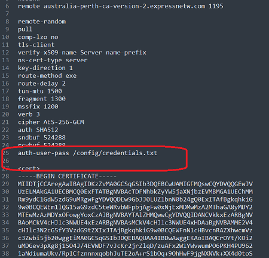

# Get VPN Config files Using Powershell

I made a PowerShell script to get Express VPN configuration files  from the Web page. It uses Html Parsing using HtmlAgilityPack;

1. I get the links for the config files (login to the express vpn website, ave the html page)

2. Use the Web Dev Tool to Get the XPATH of the links
3. Script parses the html code. [Invoke-ExtractVpnConfigFileLinks](Invoke-ExtractVpnConfigFileLinks.ps1)

### Use the Web Dev Tool to Get the XPATH of the links

## GetVPN Username and Password 

Using this [Get-VpnLoginLandingPage](Get-VpnLoginLandingPage.ps1) script.

## Configure the Authentication File Path for Configs 

Use the script [Set-VpnConfigAuthenticationFile.ps1](Set-VpnConfigAuthenticationFile.ps1)

